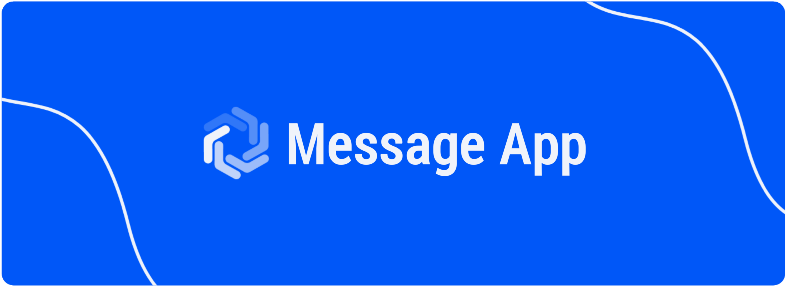
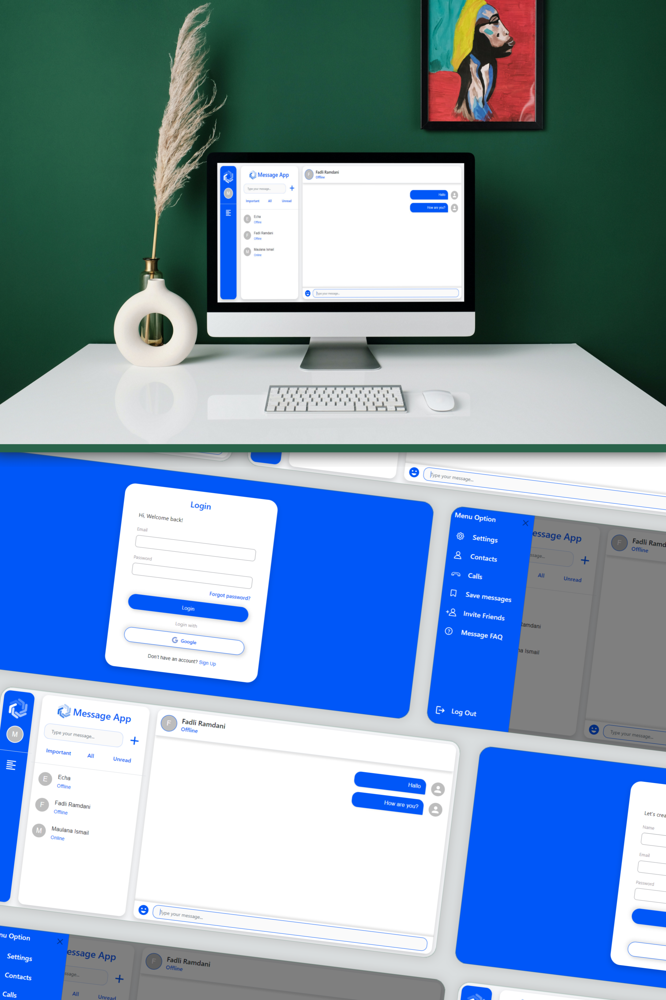

<!-- HEADER -->
<div align="center">

# 🗨️ Message App

</div>

<!-- BANNER -->


<div align="center">

<a href="https://realtime-chat-pink.vercel.app/" align="center"><strong>➥ Live Demo</strong></a> 

</div>

<!-- CONTENT -->
<!-- About The Project -->
## About The Project
Message App is a website-based real-time chat desktop application that allows users to send and receive messages from other users in real time.

### Built With
This app was built with some technologies below:
<br />


<!-- Getting Started -->
## Getting Started

### Prerequisites

This is an example of how to list things you need to use the software and how to install them.

* [Node.js](https://nodejs.org/en/download/)
* [Next.js](https://nextjs.org/docs/getting-started/installation)

### Installation

- Clone the repository
```
git clone https://github.com/MaulanaIsmail26/realtime-message-fe.git
```
- Go to repository folder
```
cd realtime-message-fe
```
- Install Module
```
npm install / npm i
```
- Connect with firebase
- Type `npm run build` To Start Development
- Type `npm run dev` To Start Production

<!-- ### Setup .env example

Create .env file in your root project folder.

```env
# app
NEXT_PUBLIC_BACKEND_URL = [API_URL]
``` -->

<!-- Contributing -->
<!-- ## Contributing

Contributions are what make the open source community such an amazing place to be learn, inspire, and create. Any contributions you make are **greatly appreciated**.

1. Fork the Project
2. Create your Feature Branch (`git checkout -b feature/AmazingFeature`)
3. Commit your Changes (`git commit -m 'Add some AmazingFeature'`)
4. Push to the Branch (`git push origin feature/AmazingFeature`)
5. Open a Pull Request -->

<!-- Demo -->
## Demo

